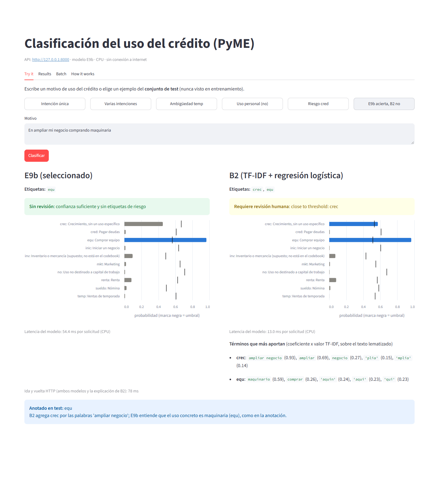
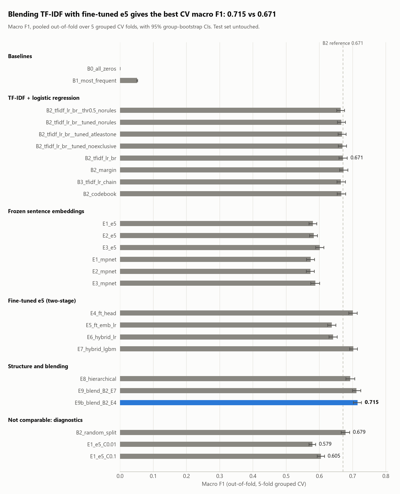

# Loan intent classification

Multi-label classification of free-text "use of proceeds" answers from SME credit
applications in Mexico (Spanish). Each answer gets one or more of 10 intent labels.
The project follows CRISP-DM; the full write-up lives in [reports/report.md](reports/report.md).

## Quick start

Requires Python 3.11; building the serving model once needs a CUDA GPU.

```bash
python -m venv .venv
source .venv/bin/activate            # Windows: .venv\Scripts\activate
pip install -e ".[dev]"
python -m spacy download es_core_news_sm
# place the raw file at data/raw/data_conf.xlsx (not versioned; confidential)

make data       # recover merged records, clean, both text branches, grouped splits
make train      # CV experiments, fine-tuning, ablation (test set untouched)
make evaluate   # single test-set evaluation (refuses to run twice), error analysis
make serve      # builds models/e9b once, then serves http://127.0.0.1:8000
```

```bash
curl -X POST http://127.0.0.1:8000/predict -H "Content-Type: application/json" \
     -d '{"text": "Compra de mercancía para surtir mi tienda"}'
# -> {"labels": [...], "probabilities": {...10 labels...}, "needs_review": false}
```

`needs_review` is true when any probability is within 0.1 of its threshold, or when
`no` (personal use) or `cred` (refinancing) is predicted.

## Demo

```bash
python app/run_demo.py      # or: make demo
```

Starts the API (loads the frozen model once, CPU, offline) and a Streamlit app at
http://localhost:8501 with four tabs: **Try it** (six test-set examples, per-label probabilities
against thresholds, review reasons, E9b vs B2 with B2's top contributing terms, latency),
**Results** (read from `reports/`), **Batch** (CSV with a `motivos` column, up to 1,000 rows,
downloadable predictions) and **How it works**. Needs `models/e9b` (built once by `make serve`
or `python -m intent.models package`).



## Results

- Selected model (E9b): 0.5 x fine-tuned multilingual-e5-base head + 0.5 x TF-IDF logistic regression; CV macro F1 0.715 [0.703, 0.727].
- Test set (988 rows, evaluated once): macro F1 0.732 [0.702, 0.759], +0.043 [+0.020, +0.065] over the TF-IDF baseline on the same rows.
- Hamming loss 0.0521 [0.0474, 0.0571] vs the company baseline's 0.06821 (likely measured on a row-level split).
- Weakest label is temp (test F1 0.400): it mixes seasonal demand and the receivables cycle.
- By hand audit, most remaining errors are labeling convention (about 58%) and label noise (about 18%); about 12% are true model errors.



## Repo layout

```
configs/base.yaml        settings, paths and the frozen selected_model section
configs/codebook.yaml    label descriptions for codebook-similarity features
src/intent/              data, preprocess, split, features, finetune, models, decode, evaluate, serve
notebooks/               one notebook per CRISP-DM phase; they only call src/intent
reports/                 report.md, TRACEABILITY.md, results.csv, test_*.csv, figures/
tests/                   pytest suite
```

All settings and paths are in `configs/base.yaml`. Seed is 42. Every experiment appends
one row to `reports/results.csv`; `reports/TRACEABILITY.md` documents when the model was
selected and when the test set was used.

Assumption: the codebook omits `inv`; we treat it as "buy inventory or merchandise".

## CRISP-DM

Each phase is covered in [reports/report.md](reports/report.md): business understanding (1),
data understanding (2), data preparation (3), modeling (4), evaluation (5), error analysis (6),
deployment and next iterations (7).
