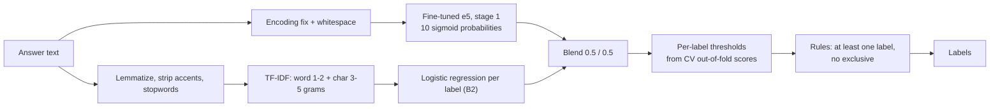
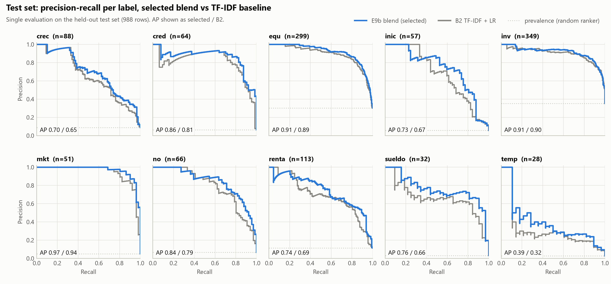
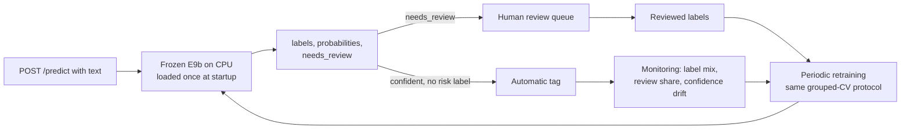

# Loan purpose classification for SME credit applications

A CRISP-DM report. CV figures are pooled out-of-fold predictions on 5,703 rows; test figures come from a single evaluation on 988 held-out rows. Brackets are 95% bootstrap intervals that resample groups of identical normalized text. Sources: `reports/results.csv`, `reports/test_*.csv`, `reports/leakage_check.csv`, `reports/TRACEABILITY.md` and `notebooks/05_error_analysis.ipynb`.

## 1. Business understanding

Konfio lends to small and medium businesses, and the application asks what the loan will be used for. Applicants answer in free Spanish text. Reading thousands of answers by hand does not scale, so today the answer is barely used. Tagging it automatically with ten intent labels turns it into a structured signal for underwriting, for product design (which needs drive demand) and for monitoring how the purposes in the portfolio shift over time.

Two labels are risk signals. `no` marks proceeds not destined to working capital, mostly personal consumption, which is not what a business loan is priced for. `cred` marks paying debts, that is refinancing, which can hide stress elsewhere. Two labels inform the loan tenor: `temp` (seasonal sales and, in practice, financing the receivables cycle) points to short, self-liquidating credit, while `cred` usually needs longer terms.

Errors do not cost the same. Missing a `no` or a `cred` lets a risk through unseen; a false alarm costs a reviewer a minute. For these labels the decision threshold should favour recall, and the trade-off should be set by the business from its own cost ratio, not by maximizing F1. The thresholds in this report maximize per-label F1 only as a neutral default that the business can move.

The primary metric, declared before modeling, is **macro F1**: every label counts equally, so rare labels such as `temp` (2.8% of rows) and `sueldo` (3.2%) cannot hide behind frequent ones. Hamming loss is kept only to compare with the company baseline (0.06821). As context, predicting no label at all already scores 0.114, because most labels are absent from most rows.

## 2. Data understanding

The file holds 6,679 rows, not the 6,726 stated in the brief. One cell contained about 22 records merged by embedded newlines, the trace of a broken CSV export; they were recovered by parsing each line (text followed by ten 0/1 values) instead of being dropped. About 42% of rows had mojibake (`mercancía`), repaired with ftfy. Nine gibberish answers and one non-text value were removed.

The data has ten label columns, but the brief's codebook defines nine: **`inv` is missing**. We assume it means buying inventory or merchandise; the texts tagged `inv` support that reading. Prevalence is very uneven: inv 34.7%, equ 29.7%, renta 11.5%, crec 9.0%, no 6.6%, cred 6.4%, inic 5.7%, mkt 4.9%, sueldo 3.2% and temp 2.8%. Most answers carry one label (86%), 12.6% carry two and 1% three, a mean of 1.15. `no` is nearly exclusive: only 4 of its 444 rows carry another label. Texts are short: median 11 words, 95th percentile 35.

Two facts shape everything downstream. First, annotation noise is measurable: **58 groups** of identical normalized text carry conflicting labels in the clean data, a direct estimate of annotator disagreement. Second, **`temp` mixes meanings**: only 21% of `temp` rows mention a season, 39% describe a receivables or payment cycle (contracts, invoices at 30 to 120 days, orders) and 42% mention neither.

## 3. Data preparation

Two text branches serve two model families. For TF-IDF, text is lowercased, lemmatized with spaCy `es_core_news_sm`, stripped of accents (keeping ñ), digits and punctuation, and filtered with a custom stopword list that keeps negations (`no`, `sin`) and domain words the default Spanish list would drop. For the transformer, text only gets the encoding fix and whitespace cleanup, because pretrained encoders expect natural text with accents and case.

The split is group-aware: the group key is the normalized text (ftfy, lowercase, collapsed whitespace), so duplicates never sit on both sides. Iterative stratification at group level carves a fixed test set of 988 rows (about 15%), touched once at the end, and five CV folds on the remaining 5,703 rows. Every choice below (model, blend weight, thresholds) was made on out-of-fold CV predictions.

## 4. Modeling

| Experiment | What it is | CV macro F1 [95% CI] |
|---|---|---|
| B0 | Predict nothing | 0.000 |
| B1 | Always the most frequent label (inv) | 0.051 [0.050, 0.053] |
| B2, fixed 0.5 | TF-IDF + logistic regression per label, 0.5 cutoff, no rules | 0.664 [0.652, 0.676] |
| **B2** | + per-label thresholds + decoding rules (reference) | **0.671 [0.659, 0.684]** |
| B3 | Classifier chain instead of one model per label | 0.665 [0.652, 0.678] |
| B2_codebook | B2 + 10 codebook-similarity features | 0.666 [0.654, 0.679] |
| E3_e5 | Frozen e5 embeddings + LR, thresholds and rules | 0.601 [0.589, 0.613] |
| E3_mpnet | Frozen mpnet embeddings + LR, thresholds and rules | 0.588 [0.574, 0.601] |
| E4 | Fine-tuned e5 head probabilities | 0.701 [0.688, 0.714] |
| E5 | Fine-tuned embedding + LR | 0.637 [0.625, 0.649] |
| E6 | Fine-tuned embedding + B2 probabilities + codebook, LR | 0.642 [0.629, 0.653] |
| E7 | Same hybrid features, LightGBM | 0.702 [0.691, 0.715] |
| E8 | Hierarchical: `no` vs business first, then E7 | 0.693 [0.680, 0.706] |
| E9 | Blend of B2 and E7 | 0.712 [0.700, 0.724] |
| **E9b (selected)** | **Blend of B2 and the fine-tuned head** | **0.715 [0.703, 0.727]** |

Five messages come out of the ablation:

1. **A lexical baseline is strong.** TF-IDF word and character n-grams with one balanced logistic regression per label reach 0.671. A classifier chain and ten hand-written codebook-similarity features add nothing measurable.
2. **Frozen multilingual embeddings lose to it** (0.601 for e5, 0.588 for mpnet). Answers are short and keyword-heavy: words like `nómina`, `renta` or `mercancía` decide the label, and general sentence embeddings blur exactly those words.
3. **Fine-tuning the encoder changes the picture.** Following the brief, e5 was fine-tuned as a feature extractor (stage 1) and a classical model was trained on its features (stage 2). LightGBM on the fine-tuned embedding, B2's out-of-fold probabilities and the codebook similarities (E7) reaches 0.702, above B2. Logistic regression on the same features does not (0.637 and 0.642), and the fine-tuned head alone scores 0.701.
4. **The fine-tuned model and TF-IDF fail differently, so combining them wins.** On CV rows the fine-tuned head is better on 1,000 rows and B2 on 695. A plain blend of the two (E9b) is the best configuration at 0.715. Blending B2 into E7 reaches 0.712, and routing `no` first (E8) lowers macro F1 to 0.693.
5. **Thresholds and decoding rules are cheap but marginal**: B2 moves from 0.664 at a fixed 0.5 cutoff to 0.671.

**The selected model, as frozen in `configs/base.yaml` (`selected_model`, E9b).** Probabilities are 0.5 times the fine-tuned e5 head plus 0.5 times B2.
- **Stage 1:** `intfloat/multilingual-e5-base` with the "query: " prefix, mean pooling, dropout 0.1 and a linear head with ten sigmoid outputs. It is trained with BCE weighted by neg/pos per label (capped at 10), max length 96, batch 32, fp16, AdamW at 2e-5 with weight decay 0.01, 10% linear warmup and 4 epochs. Early stopping (patience 1) uses an inner 10% group-aware slice of the training folds. The word-embedding matrix is frozen so training fits on an 8 GB GPU.
- **B2:** TF-IDF on word 1-2 grams and character 3-5 grams within word boundaries (min_df 2, sublinear tf), with a balanced logistic regression per label (C 1.0, liblinear).
- **Blend weight:** chosen from a grid from 0 to 1 in steps of 0.05 by macro F1, cross-fitted per fold for the CV estimate and refit on all CV rows for deployment.
- **Thresholds:** each label's threshold maximizes its F1 on CV out-of-fold scores.
- **Decoding:** every answer gets at least one label (the most probable, as a fallback), and the other labels are suppressed when `no` is the top label and above its threshold.

**Stacking limitation.** The stage-2 models (E5 to E7) train on out-of-fold features. But when fold j is evaluated, its training rows carry embeddings from encoders fine-tuned on folds that include j, so fold j's labels reach stage 2 indirectly. Full nested CV would need about 25 fine-tunes instead of 5 and was judged not worth it; the untouched test set is the clean check. The selected blend is not affected: it trains nothing on stage-1 features and fits only one weight and ten thresholds on out-of-fold scores.

## 5. Evaluation

| Test metric (988 rows) | E9b (selected) | B2 (reference) |
|---|---|---|
| Macro F1 | **0.732** [0.702, 0.759] | 0.689 [0.659, 0.714] |
| Micro F1 | 0.787 [0.768, 0.806] | 0.753 [0.734, 0.772] |
| Hamming loss | **0.0521** [0.0474, 0.0571] | 0.0618 [0.0569, 0.0670] |
| Samples F1 | 0.797 [0.777, 0.818] | 0.764 [0.744, 0.785] |
| temp F1 | 0.400 [0.241, 0.548] | 0.338 [0.209, 0.463] |
| Macro precision | 0.692 [0.660, 0.723] | 0.638 [0.609, 0.667] |
| Micro precision | 0.749 [0.726, 0.771] | 0.702 [0.679, 0.723] |
| Macro recall | 0.783 [0.754, 0.815] | 0.757 [0.723, 0.788] |
| Mean PR-AUC | 0.779 [0.751, 0.811] | 0.732 [0.702, 0.763] |

**The paired difference on the same rows confirms the CV ranking.** Macro F1 is **+0.043 [+0.020, +0.065]**, samples F1 +0.033 [+0.017, +0.048], and Hamming loss is 0.0097 lower [0.0059, 0.0135]. `temp` improves by 0.062, but its interval [-0.076, +0.200] is wide with only 28 test positives. Test macro F1 (0.732) is slightly above the CV estimate (0.715). The CV estimate lies inside the test interval, and the final models were trained on all 5,703 CV rows rather than four fifths of them.

**Company baseline.** Our Hamming loss is 0.0521 against their 0.06821, and the upper end of our interval (0.0571) is below their figure. The comparison is indicative only: their test set and row count differ, and their split was likely row-level. Our leakage check measures what a row-level split does. On CV, B2 with a row-level split scores 0.679 macro F1 and 0.0633 Hamming loss, against 0.671 and 0.0650 with the grouped split. The inflation is small (largest on `temp`: 0.420 against 0.384), so our gain is not a split artifact, and their figure would likely be slightly worse under our protocol.

**Their "average precision 67%" is ambiguous**, so we report each reading. Mean PR-AUC is 0.779 [0.751, 0.811] and micro precision 0.749 [0.726, 0.771], both clearly above 67%. Macro precision is 0.692 [0.660, 0.723]: above it, but inconclusive, since the interval includes 0.67.

| Label | Precision | Recall | F1 | PR-AUC | Support |
|---|---|---|---|---|---|
| crec | 0.587 | 0.693 | 0.635 | 0.697 | 88 |
| cred | 0.779 | 0.828 | 0.803 | 0.856 | 64 |
| equ | 0.837 | 0.843 | 0.840 | 0.912 | 299 |
| inic | 0.651 | 0.719 | 0.683 | 0.728 | 57 |
| inv | 0.797 | 0.903 | 0.847 | 0.911 | 349 |
| mkt | 0.842 | 0.941 | 0.889 | 0.967 | 51 |
| no | 0.839 | 0.788 | 0.812 | 0.836 | 66 |
| renta | 0.638 | 0.779 | 0.701 | 0.739 | 113 |
| sueldo | 0.580 | 0.906 | 0.707 | 0.757 | 32 |
| temp | 0.375 | 0.429 | 0.400 | 0.393 | 28 |

**Traceability.** E9b was selected on CV at about 15:12 on 2026-10-02, and the test set was evaluated once, at 15:37. The `model-selection-frozen` tag and the first commit were created afterwards (19:36), as a record, not as proof of ordering. Config hash `1f3cf3b6c783`, written by the test run, matches the byte-exact test-time config, which already contained the selection (`reports/TRACEABILITY.md`).

## 6. Error analysis

On CV out-of-fold predictions, 63.8% of rows get the exact label set right, against a macro F1 of 0.715.

**cleanlab flags 1,413 of the 5,703 CV rows (24.8%) as possible label errors.** That is an upper bound, not an estimate: a row is flagged if any of its ten labels looks wrong, and confident model mistakes are flagged too. The top of the ranking is convincing: 7 of the 10 most suspicious rows are clear annotation errors (for example "PARA COMPRAR MÁS MATERIA PRIMA" tagged `equ`). Conflicting duplicates are flagged at 42%, against 25% overall.

**50 random errors were labeled by hand to separate the causes.** The hand labels agree with the automatic categories on 80% of rows (Cohen's kappa 0.67). There are three caveats: a single annotator, who saw the automatic category while labeling, and 50 rows give wide intervals. By hand:
- **Labeling convention: about 58% of errors** [44%, 71%]. The answer names several uses, and the model and the annotator tag different subsets.
- **Label errors: about 18%** [10%, 31%].
- **True model errors: about 12%** [5.6%, 23.8%], on clear, correctly labeled text.

Most of the remaining error therefore sits in the labels and the codebook, not in the model.

**`equ` against `inv` is the largest confusion**: 102 rows of `equ` were predicted as `inv`, and 53 the other way. The boundary between durable goods and stock is undefined because `inv` is undefined. **`temp`'s ceiling follows from its definition**: 17% of `temp` rows lose the label to `inv` (seasonal stock purchases), and 42% of `temp` texts mention neither a season nor a payment cycle.

**One pattern needs a business decision.** B2 learned the annotators' habit of inferring `inv` from the business type. "Invertir en mi tienda de abarrotes" is tagged `inv` although the text names no use; B2 agrees, while the fine-tuned model reads it literally as growth. Whether the model should read the text literally or replicate the annotators' convention is a policy choice, and the codebook should state it.

## 7. Deployment and next iterations

`src/intent/serve.py` exposes `POST /predict`, which returns the labels, the ten blended probabilities and `needs_review`. The model is loaded once at startup from artifacts rebuilt from the frozen recipe; their predictions were checked against the evaluated run without reading test labels. Measured on the development laptop's CPU (Intel Core i9-10980HK, 8 threads), one text per request over 200 requests after 10 warm-up requests, E9b answers in 31.7 ms at the median and 47.6 ms at the 95th percentile; B2 alone takes 5.3 ms and 6.6 ms (`reports/latency.csv`). No GPU is needed to serve either model.

- **Human review.** `needs_review` is true when any probability lies within 0.1 of its threshold, or when `no` or `cred` is predicted, since both change the credit decision.
- **Threshold policy owned by the business.** F1-optimal thresholds are a starting point, not a policy. `sueldo`, for example, currently runs at precision 0.58 and recall 0.91; if a wrong payroll flag is costly, its threshold should go up. For `no` and `cred`, the business should fix a target recall and accept the review load it implies.
- **Monitoring.** Track the weekly label distribution against training prevalence, the share of requests needing review and the distribution of the top probability (confidence drift). A sustained shift triggers a labeled sample.
- **Retraining.** Reviewers' decisions become new labels. Periodic retraining reruns the same grouped-CV protocol and is evaluated on a fresh held-out sample.

**Next iteration, in priority order:**
1. **Revise the codebook.**
   - Define `inv` (goods for resale, raw materials and inputs, with durable assets under `equ`).
   - Split `temp` into season and cycle.
   - Make `crec` the residual for answers with no specific use.
   - Tag every stated use.
2. **Relabel the cleanlab-flagged rows**, starting from the lowest label quality.
3. **Active learning**: send low-confidence cases to annotators first.
4. **LLM-assisted labeling audit**: an LLM as a second annotator that flags disagreements for human review, not as ground truth.

**B2 is the fallback when latency or GPU cost matters.** It answers in about 5 ms per request instead of about 32 ms, retrains on a CPU without a GPU fine-tune, and costs 0.043 macro F1 on the test set.

## 8. Conclusion

A group-aware split, a test set touched once and a metric declared upfront make these numbers trustworthy. TF-IDF is a strong baseline that frozen embeddings do not beat, while a fine-tuned e5 does. Blending the two gives the best model: 0.732 macro F1 and 0.0521 Hamming loss on the test set, ahead of both B2 and the company baseline. The error analysis shows that most remaining errors come from the labeling convention and label noise rather than from the model. The cheapest next gain is therefore a clearer codebook and a relabeling pass, with business-set thresholds and human review on the risk labels.
